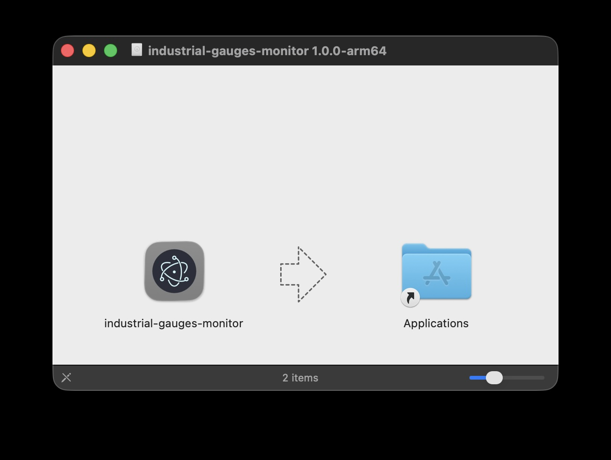
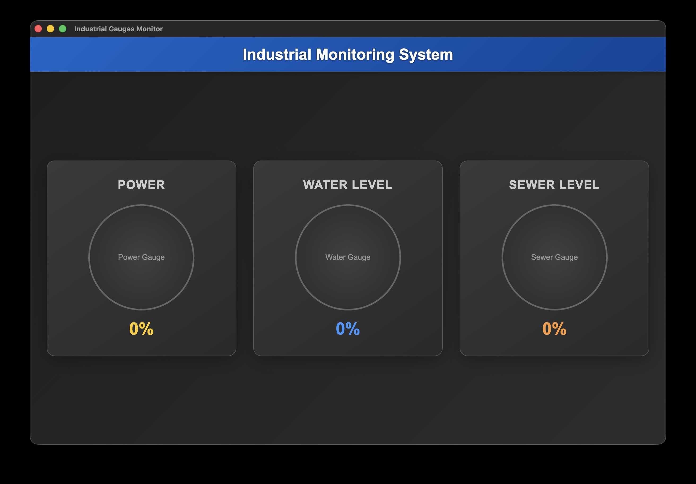

# Industrial Gauges Monitor

Cross-platform Electron app displaying industrial gauges for power, water, and sewer monitoring.




## Getting Started

### Prerequisites

- Node.js (v14 or higher)
- npm

### Installation

1. Clone the repository:
   ```bash
   git clone <repository-url>
   cd electron-sample
   ```

2. Install dependencies:
   ```bash
   npm install
   ```

3. Start the application:
   ```bash
   npm start
   ```

## Available Scripts

- `npm start` - Run the app in development mode
- `npm run dev` - Run with development environment and dev tools
- `npm test` - Run tests
- `npm run lint` - Lint the code
- `npm run build` - Build the app for distribution
- `npm run build:current` - Build for current platform only
- `npm run build:win` - Build for Windows
- `npm run build:mac` - Build for macOS
- `npm run build:linux` - Build for Linux
- `npm run build:all` - Build for all platforms

## Project Structure

```
electron-sample/
├── main.js           # Main Electron process
├── preload.js        # Preload script for security
├── src/
│   ├── index.html    # Main renderer HTML
│   ├── renderer.js   # Renderer process JavaScript
│   └── styles.css    # Application styles
└── assets/           # App icons and resources
```

## Troubleshooting

### Build Issues

If you encounter `Cannot find module './out/cli/cli'` error when building:

```bash
npm uninstall electron-builder
npm install --save-dev electron-builder
```

This fixes corrupted electron-builder installations.

## License

ISC
